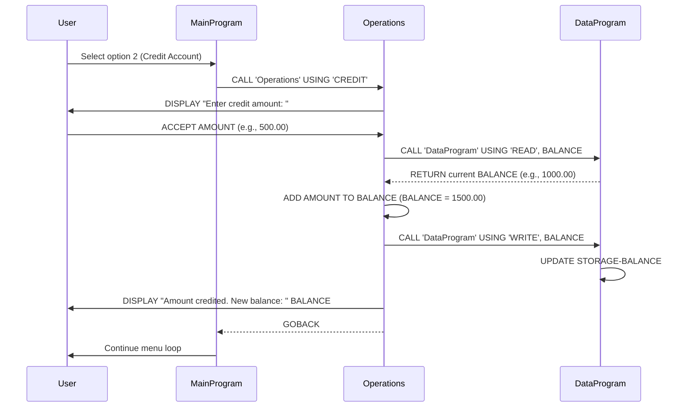

# COBOL Student Account Management System

This project contains a simple COBOL-based student account management system that allows users to view, credit, and debit account balances.

## Project Structure

```
src/
  cobol/
    data.cob       - Data access layer for account balance
    main.cob       - Main program with user interface menu
    operations.cob - Business logic for account operations
```

## COBOL Files Documentation

### data.cob (DataProgram)
**Purpose**: Acts as a data access layer for storing and retrieving account balance information.

**Key Functions**:
- `READ` operation: Retrieves the current balance from storage
- `WRITE` operation: Updates the balance in storage

**Data Structures**:
- `STORAGE-BALANCE`: Internal balance storage (PIC 9(6)V99, initial value 1000.00)
- `OPERATION-TYPE`: Type of operation being performed (READ/WRITE)
- `PASSED-OPERATION`: Input parameter for operation type
- `BALANCE`: Input/output parameter for balance value

### main.cob (MainProgram)
**Purpose**: Provides the main user interface and program flow control for the account management system.

**Key Functions**:
- Displays a menu with options for account operations
- Accepts user input for menu selection
- Calls appropriate operations based on user choice
- Handles program exit

**Menu Options**:
1. View Balance - Displays current account balance
2. Credit Account - Adds funds to the account
3. Debit Account - Subtracts funds from the account
4. Exit - Terminates the program

### operations.cob (Operations)
**Purpose**: Contains the business logic for performing account operations and interacting with the data layer.

**Key Functions**:
- `TOTAL` operation: Retrieves and displays current balance
- `CREDIT` operation: Adds specified amount to balance
- `DEBIT` operation: Subtracts specified amount from balance (with validation)

**Business Rules**:
- **Initial Balance**: All accounts start with a balance of $1000.00
- **Credit Operations**: Any positive amount can be credited to the account
- **Debit Operations**: Debits are only allowed if the account has sufficient funds (balance >= debit amount)
- **Insufficient Funds**: If a debit amount exceeds the current balance, the transaction is rejected with an error message

## Usage
1. Compile the COBOL programs
2. Run the MainProgram
3. Follow the menu prompts to perform account operations

## Dependencies
- COBOL compiler (e.g., GnuCOBOL)
- No external libraries required

## Sequence Diagram

The following sequence diagram illustrates the data flow for a credit operation in the account management system:

